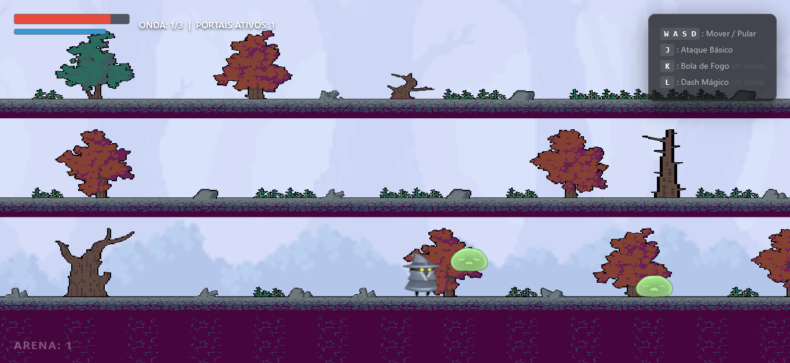
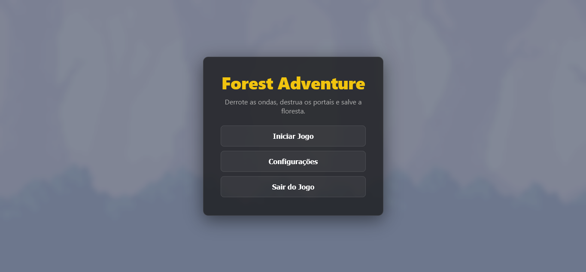
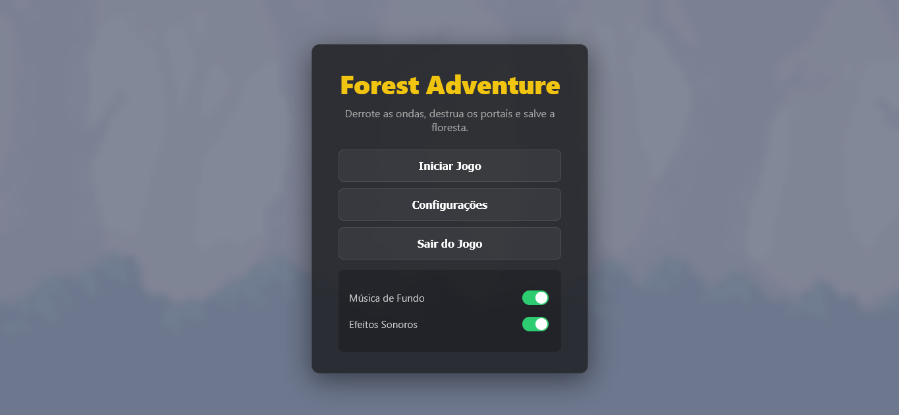
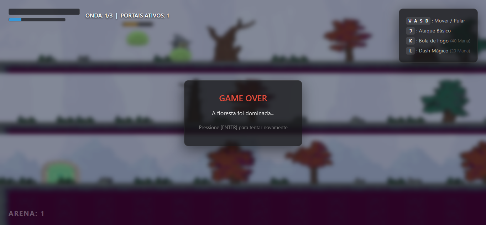


# 🧙‍♂️ Arena de Sobrevivência Mágica

<p align="center">
  
</p>

Este é um jogo de plataforma de ação focado em combate de arena e sobrevivência a ondas sequenciais[cite: 1]. Foi desenvolvido inteiramente em JavaScript utilizando a biblioteca **Three.js** com uma câmara ortográfica para simular uma perspetiva clássica em duas dimensões[cite: 1].

O desafio consiste em controlar um Mago que deve derrotar hordas de *Slimes* comuns e um chefe final (*Guardião*) num ambiente vertical fechado[cite: 1].

---

### 🧠 Equipe:

- Fernando Anderson Borges - 511344
- Francisco Felipe Rodrigues de Sousa - 499193
- Ianque Pereira da Silva - 471014
- Ismael Johnny Marques Ferreira - 398901
- William do Vale Mesquita - 390185

---

### ✨ Características Principais

- ⚔️ **Combate Dinâmico**: Sistema de combate com ataques básicos e magias especiais.
- 💎 **Sistema de Mana**: Gerencie recursos para usar habilidades poderosas.
- 🧠 **IA Adaptativa**: Inimigos com comportamentos distintos e sistema de loot inteligente.
- 🏆 **Sistema de Ranking**: Avaliação de desempenho baseada em tempo e dano sofrido.
- 🌳 **Ambiente Imersivo**: Cenário detalhado com efeitos visuais e sonoros.

---

## 🛠️ Tecnologias Utilizadas

- Three.js (v0.160.1)
- JavaScript
- HTML5
- CSS3

## ⚙️ Instalação e Configuração Local

O jogo utiliza módulos ES6 (`import`/`export`) e a biblioteca Three.js. Para correr o projeto corretamente e evitar erros de CORS ou loops acelerados (Frame-Rate Dependent Logic), é necessário utilizar um servidor local.

### 🛠️ 1. Pré-requisitos
* **Node.js** instalado (recomenda-se a versão LTS).

### 🛠️ 2. Instalação de Dependências
Abre o terminal na pasta raiz do projeto e executa:

```bash
# Inicializa o projeto (se ainda não existir o package.json)
npm init -y

# Instala o Vite (Servidor de desenvolvimento e Bundler)
npm install vite --save-dev

# Instala o motor gráfico Three.js
npm install three

```

### 🛠️ 3. Configurar o `package.json`

Certifica-te de que a secção `"scripts"` no teu `package.json` está assim:

```json
"scripts": {
  "dev": "vite",
  "build": "vite build",
  "preview": "vite preview"
}

```

### 🎮 4. Rodar o Jogo

Executa o servidor local com o comando:

```bash
npm run dev

```

Abre o link fornecido no terminal (geralmente `http://localhost:5173/`).

### 5. Deploy (Publicar no GitHub Pages)

Para publicares o jogo online de forma otimizada:

```bash
npm run build

```

O Vite criará uma pasta `dist`. É o conteúdo desta pasta que deve ser enviado para o teu serviço de hospedagem (GitHub Pages, Vercel, Netlify).

---

## 🎮 Guia de Jogabilidade e Controlos

Sobrevive a **3 ondas** de dificuldade incremental. O jogo culmina com o aparecimento do Guardião na fase final.

| Ação | Tecla / Comando | Detalhes |
| --- | --- | --- |
| **Movimento** | `A` / `D` (ou Setas) | Move o protagonista rapidamente para as laterais.

 |
| **Pulo** | `Z` | Salto estável para navegação vertical. Podes atravessar plataformas de baixo para cima.

 |
| **Ataque Básico** | `X` | Projéteis de fogo horizontais. Consumo de 0 Mana. |
| **Bola de Fogo** | `C` | Feitiço massivo perfurante. Consome uma taxa fixa de **25 pontos de Mana**.

 |
| **Pausa** | `ESC` | Pausa a ação e a música. |

---

## 🛠️ Arquitetura e Level Design

O cenário foi estruturado para incentivar a movimentação tática. A arena está delimitada por duas barreiras laterais invisíveis e divide-se em três níveis principais:

* **Nível 1 (Chão Principal):** Base plana para recolha de itens.


* **Nível 2 (Plataforma Intermédia):** Colisores *one-way* para passagem fluida.


* **Nível 3 (Plataforma Superior):** Posição tática elevada e ponto de origem do Boss.


* **Física:** Vão livre de 130 pixels entre andares para garantir a fluidez do pulo sem colisões com o teto.


---

## 🧠 Sistemas Dinâmicos

### Inimigos e Spawn

* **Slimes Comuns:** Movem-se com impulsos balísticos cíclicos. Possuem uma *hitbox* fixa de 50x50 píxeis para evitar *tunnelling*.

* **O Guardião (Boss):** Surge na Onda 3, apresenta uma escala de 85 unidades e tonalidade avermelhada. Executa perseguição contínua, abdicando de rotas de patrulha.

* **Prevenção de Pop-in:** O algoritmo avalia a posição do jogador. Se o *spawn* for a menos de 420 pixels (visível no ecrã), o monstro nasce na extremidade oposta.


### 🎁 IA de Loot (Utility AI)

A eliminação de criaturas ativa uma probabilidade de recompensa baseada na utilidade:

* **Quadrado Vermelho:** Restaura pontos de Saúde (HP).

* **Quadrado Azul:** Devolve 40 pontos de Mana.

* **Quadrado Dourado:** Ativa *Buff* de Dano por 6 segundos (duplica ataque).


### 🏆 Sistema de Ranking

Ao concluir a arena, recebes uma avaliação partindo de uma pontuação base de 1000 pontos:

* **S+**: Pontos >= 900 (Sem dano sofrido, ritmo veloz).

* **S**: Pontos >= 750.

* **A**: Pontos >= 600.

* **B**: Pontos >= 450.

* **C**: Pontos < 450 (Nível elevado de penalizações).

---

## 📊 Analisando o Arena de Sobrevivência Mágica

#### 🎮 Game Design

- Progressão clara entre ondas.
- Sistema de mana e buffs bem integrado.
- Loot adaptativo baseado no estado do jogador.
- Ranking que incentiva replayabilidade.

#### 🖥️ UI/UX

- Interface simples e eficiente.
- Feedback visual consistente.
- Sistema de pausa completo.

#### 🎨 Arte e Composição Visual

- Pixel art coerente.
- Ambiente detalhado e imersivo.
- Efeitos de névoa, iluminação e parallax.

#### ⚔️ Gameplay

- Controles responsivos.
- Combate satisfatório.
- IA funcional.
- Estabilidade em 60 FPS.

#### 💻 Aplicação Técnica

- Uso eficiente de iluminação.
- Sistema de partículas otimizado.
- Câmera ortográfica com suavização.
- Cenário com profundidade visual.

---

## ⭐ Visualização do projeto:

### Tela inicial:

<p align="center">
  
</p>

### Configurações:

<p align="center">
  
</p>

### Fim de jogo:

<p align="center">
  
</p>
